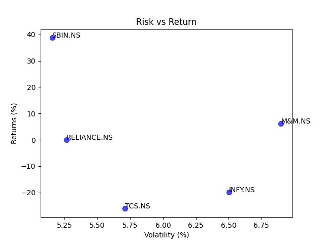
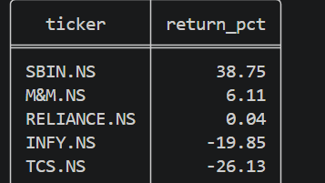
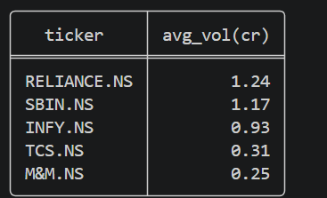
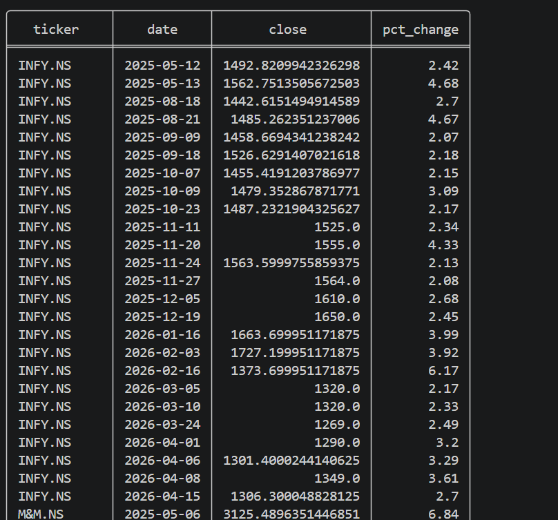
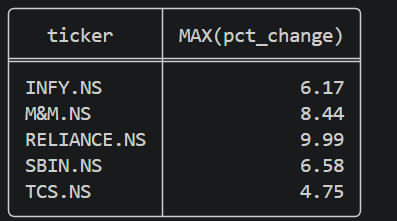
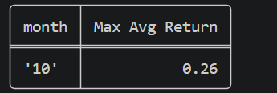
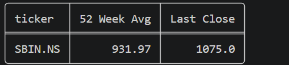

# 📈 Stock Analysis Dashboard

## 📌 Description
This project analyzes stock data using Python. It fetches data using yfinance, stores it in SQLite, calculates key metrics like returns and volatility, and visualizes them using a scatter plot.

## 🚀 Features
- Data fetching using yfinance
- SQLite database storage
- Financial metrics calculation
- Risk vs Return visualization

## 🛠 Tech Stack
- Python
- pandas, numpy
- matplotlib
- SQLite

## 📂 Project Structure
- main.py → data fetching & storage
- graphdisplay.py → visualization
- stocks.db → database

## ▶️ How to Run
pip install pandas numpy matplotlib yfinance  
python main.py  

## 📊 Output

SBIN returned 38.75% with the lowest volatility (5.2%) of all 5 stocks

## 📌 Insights
- SBIN performed best (high return, low volatility)
- TCS and INFY underperformed
- Risk does not always lead to higher returns

## 🔮 Future Work
- Add Sharpe Ratio
- Build interactive dashboard

## SQL Query OUTPUT
**1. Best Performing Stock by Return**

SBIN led with 38.75% return. TCS was the worst performer at -26.13%.

**2. Avg Volume Per Stock**

RELIANCE with highest avg volume 1.24CR. M&M with lowest avg volume 0.25CR

**3. Dates where stock moves up 2%**

**4. A query finding the most pct change per stock**

RELIANCE with the highest percentage change in a day(9.99%). TCS with the lowest percentage change in a day(4.75%).

**5. A query showing which month had the best average returns**

October had the best avg return among all stocks(0.26%).

**6. A query finding stocks that closed above their 52-week average**

Only SBI closed above their 52 week avg